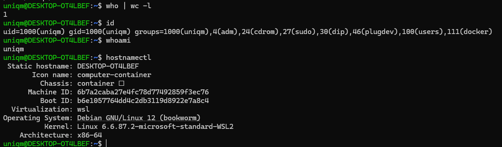
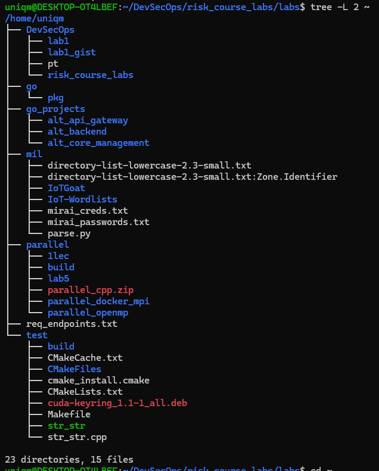
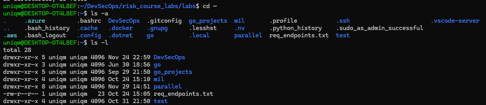
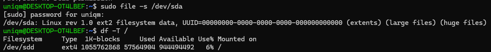
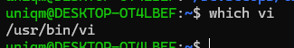
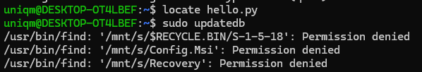
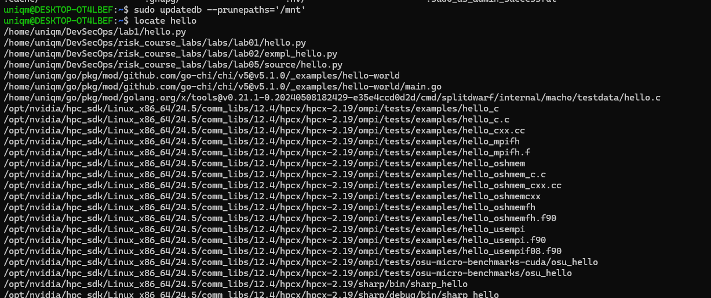
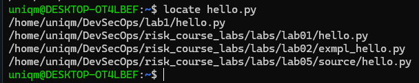
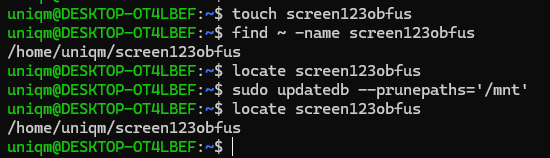
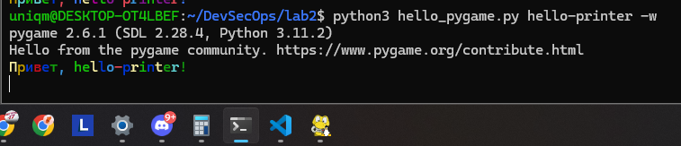

<div align="center">
<h1><a id="intro">Лабораторная работа №2</a><br></h1>
<a href="https://docs.github.com/en"></a>
<a href="https://daringfireball.net/projects/markdown"></a> 
<a href="https://symbl.cc/en/unicode-table"></a> 
<a href="https://shields.io"></a>
<a href="https://img.shields.io/badge/Risk_Analyze-2448a2"></a> </a> </a></div>

***

## Задание

- [X] 1. Выведите на терминале и проанализируйте следующие команды консоли

```bash
$ who | wc -I
$ id
$ whoami
$ hostnamectl
````



**Пояснение:**

* `who | wc -l` — показывает количество активных пользовательских сессий. В моём случае результат `1`, то есть в системе активен только один пользовательский терминал.
* `id` — выводит идентификатор пользователя (`uid`), основную группу (`gid`) и список дополнительных групп. Видно, что пользователь `uniqm` входит в группы `adm`, `sudo`, `docker`.
* `whoami` — выводит имя текущего пользователя.
* `hostnamectl` — показывает информацию о хосте и системе: имя машины (`DESKTOP-OT4LBEF`), тип виртуализации (`wsl`), дистрибутив (Debian 12), версию ядра и архитектуру.

---

- [X] 2. Выведите утилитой `tree` список вложенности дерева диреторий для каталога своего пользователя. Далее используйте `ls -a` и укажите отличие от `ls -l`.





**Пояснение:**

* `tree -L 2 ~` показывает иерархию каталогов в виде дерева до глубины 2 уровня (иначе вывод перегружен множеством вложенных файлов/директорий).
* `ls -a` выводит все файлы, в том числе скрытые.
* `ls -l` показывает детализированный список: права доступа, владелец, группа, размер и дату изменения, но только для нескрытых элементов по умолчанию.

---

- [X] 3. Используйте утилиту `file` и `df` для определения какая файловая система на разделе `/dev/sda1`.

_В моём случае раздела `/dev/sda1` нет, поэтому используется `/dev/sda`._



**Пояснение:**

* `file -s /dev/sda` анализирует сырое устройство и определяет тип файловой системы. В выводе видно, что на `/dev/sda` обнаружена файловая система семейства `ext2/ext4` (Linux filesystem data).
* `df -T /` показывает тип файловой системы для корневого раздела `/`. В данном случае корень смонтирован с `/dev/sdd` и имеет тип `ext4`.

---

- [X] 4. Выведите на терминале и проанализируйте следующие команды консоли

```bash
$ which vi
$ locate hello.py
$ sudo updatedb
$ locate hello
$ touch screen
$ find ~ -name screen
$ locate screen
$ sudo updated
$ locate screen
```





_Так как я рабоотаю на WSL, в каталоге /mnt у меня смонтирована вся файловая система хостовой Windows машины, поэтому этот каталог исключаю из вывода сказа с помощью флага `--prunepaths`._







**Пояснение:**

* `which vi` — выводит путь к бинарному файлу редактора `vi`, который будет запущен по умолчанию.
* `locate hello.py` — ищет файл по имени в заранее построенной базе `mlocate`. До запуска `updatedb` нужных совпадений может не быть.
* `sudo updatedb --prunepaths='/mnt'` — обновляет базу путей для `locate`, исключая из индексации каталог `/mnt` (в моём случае там смонтированы диски Windows, и их индексация сильно замедляет работу).
* Повторный `locate hello` показывает все файлы и каталоги, в имени которых встречается подстрока `hello`, уже с учётом обновлённой базы.
* `touch screen123obfus` создаёт пустой файл `screen123obfus`.
* `find ~ -name screen123obfus` выполняет поиск по файловой системе, проходя дерево каталогов от `~`.
* `locate screen123obfus` сначала ничего не находит (база устарела), после `updatedb` — начинает видеть новый файл. Это демонстрирует разницу между `find` (работает прямо по диску) и `locate` (работает по базе).

---

-  [X] 5. Используйте конструкцию и вставьте ее в созданный файл ранее. Подключите `pygame` - используем исключительно для стилизации окна.

```python
"""
Модуль для приветствия пользователя
"""
import random
from typing import Optional
import typer
import pygame


app = typer.Typer(help="Утилита для приветствия пользователя.")


COLORS = [
    "\033[31m",
    "\033[32m",
    "\033[33m",
    "\033[34m",
    "\033[35m",
    "\033[36m",
    "\033[91m",
    "\033[92m",
    "\033[93m",
    "\033[94m",
    "\033[95m",
    "\033[96m",
]

RESET = "\033[0m"


def rainbow_print(text: str):
    """Выводит строку, в которой каждая буква случайного цвета"""
    out = []
    for ch in text:
        color = random.choice(COLORS)
        out.append(f"{color}{ch}{RESET}")
    print("".join(out))


def show_pygame_window(text: str = "Hello appsec world*"):
    """
    Открывает окно pygame и выводит в нём текст.
    Используется только для стилизации окна (по заданию).
    """
    if pygame is None:
        typer.echo("pygame не установлен. Установите его: pip install pygame")
        raise typer.Exit(code=1)

    pygame.display.init()
    pygame.font.init()

    screen_width = 800
    screen_height = 600
    window_size = (screen_width, screen_height)

    screen = pygame.display.set_mode(window_size)
    pygame.display.set_caption("AppSec greeting")

    bg_color = (255, 255, 255)

    font = pygame.font.SysFont(None, 75)
    text_surface = font.render(text, True, (0, 200, 0))
    text_rect = text_surface.get_rect(center=(screen_width // 2, screen_height // 2))

    clock = pygame.time.Clock()
    running = True

    while running:
        for event in pygame.event.get():
            if event.type == pygame.QUIT:
                running = False
            if event.type == pygame.KEYDOWN and event.key == pygame.K_ESCAPE:
                running = False

        screen.fill(bg_color)
        screen.blit(text_surface, text_rect)
        pygame.display.flip()
        clock.tick(60)

    pygame.quit()


@app.command()
def hello_printer(
    name: str = typer.Argument(..., help="Имя пользователя."),
    lastname: str = typer.Option("", help="Фамилия пользователя."),
    formal: bool = typer.Option(False, "--formal", "-f", help="Формальное приветствие."),
    antiformal: bool = typer.Option(False, "--antiformal", "-af", help="Неформальное приветствие."),
    window: bool = typer.Option(
        False,
        "--window",
        "-w",
        help="Открыть графическое окно с надписью 'Hello appsec world*' (pygame).",
    ),
):
    """
    Здоровается с пользователем, используя повседневный, формальный или неформальный стиль.
    При необходимости открывает окно pygame.
    """
    if formal:
        greeting = f"Добрый день, {name} {lastname}!"
    elif antiformal:
        greeting = f"Здаров, {name}!"
    else:
        greeting = f"Привет, {name}!"

    rainbow_print(greeting)

    if window:
        show_pygame_window("Hello appsec world*")


if __name__ == "__main__":
    app()
```



**Пояснение:**

Функция `show_pygame_window` создаёт графическое окно размером 800×600 с текстом `Hello appsec world*`, однако в WSL окно создаётся, что мы можем увидеть на панели задач, однако не открывается, так как у нас чисто терминальное приложение без возможности создавать графические приложения. Только если не прокидывать инструменты Windows системы для отрисовки окон внуть WSL, что выходит за рамки ЛР.

---

- [X] 6. Сделайте `commit` и `push` в свой репозиторий с изменениями в `master branch`. На следующих лабораторных работах мы вернемся к этому файлу.

```bash
uniqm@DESKTOP-OT4LBEF:~/DevSecOps/lab1$ git status
On branch gist
Changes not staged for commit:
  (use "git add <file>..." to update what will be committed)
  (use "git restore <file>..." to discard changes in working directory)
        modified:   hello.py

no changes added to commit (use "git add" and/or "git commit -a")
uniqm@DESKTOP-OT4LBEF:~/DevSecOps/lab1$ git add hello.py
uniqm@DESKTOP-OT4LBEF:~/DevSecOps/lab1$ git commit -m "Add pygame window"
[gist e2fee10] Add pygame window
 1 file changed, 70 insertions(+), 11 deletions(-)
uniqm@DESKTOP-OT4LBEF:~/DevSecOps/lab1$ git push origin master
```

---

- [X] 7. Выведите на терминале и проанализируйте следующие команды консоли

```bash
uniqm@DESKTOP-OT4LBEF:~/DevSecOps/lab1$ groups
uniqm adm cdrom sudo dip plugdev users docker
uniqm@DESKTOP-OT4LBEF:~/DevSecOps/lab1$ sudo useradd smallman
uniqm@DESKTOP-OT4LBEF:~/DevSecOps/lab1$ sudo userdel smallman -rf
userdel: smallman mail spool (/var/mail/smallman) not found
userdel: smallman home directory (/home/smallman) not found
uniqm@DESKTOP-OT4LBEF:~/DevSecOps/lab1$ sudo useradd smallman
uniqm@DESKTOP-OT4LBEF:~/DevSecOps/lab1$ sudo passwd smallman
New password:
Retype new password:
passwd: password updated successfully
uniqm@DESKTOP-OT4LBEF:~/DevSecOps/lab1$ sudo usermod smallman -c 'Hach Hachov Hacherovich,239,45-67,499-239-45-33'
uniqm@DESKTOP-OT4LBEF:~/DevSecOps/lab1$ sudo cat /etc/passwd | grep smallman
smallman:x:1001:1001:Hach Hachov Hacherovich,239,45-67,499-239-45-33:/home/smallman:/bin/sh
uniqm@DESKTOP-OT4LBEF:~/DevSecOps/lab1$ sudo passwd smallman
New password:
Retype new password:
passwd: password updated successfully
uniqm@DESKTOP-OT4LBEF:~/DevSecOps/lab1$ id smallman
uid=1001(smallman) gid=1001(smallman) groups=1001(smallman)
uniqm@DESKTOP-OT4LBEF:~/DevSecOps/lab1$ sudo groupadd -g 1500 readgroup
uniqm@DESKTOP-OT4LBEF:~/DevSecOps/lab1$ sudo usermod -aG readgroup smallman
uniqm@DESKTOP-OT4LBEF:~/DevSecOps/lab1$ sudo chmod 666 ~/screen123obfus
```

**Пояснение:**

* `groups` показывает, в какие группы входит текущий пользователь.
* `useradd smallman` создаёт нового пользователя `smallman`.
* `userdel smallman -rf` удаляет пользователя и его ресурсы (в данном случае выдаёт предупреждения, что почтовый ящик и домашний каталог отсутствуют).
* `passwd smallman` задаёт или изменяет пароль пользователя `smallman`.
* `usermod smallman -c '...'` добавляет комментарий к записи пользователя в `/etc/passwd`.
* `id smallman` показывает UID/GID и группы пользователя `smallman`.
* `groupadd -g 1500 readgroup` создаёт новую группу `readgroup` с GID=1500.
* `usermod -aG readgroup smallman` добавляет пользователя `smallman` в дополнительную группу `readgroup`.
* `chmod 666 ~/screen123obfus` временно даёт права чтения и записи всем пользователям к файлу `screen123obfus` (будет скорректирован на следующих шагах).

---

- [X] 8. Выведите группу прав для `screen` и измените, что бы файл был доступен только для чтения созданному пользователю и выведите права этого пользователя для измененного файла только используя `readgroup`.

```bash
uniqm@DESKTOP-OT4LBEF:~/DevSecOps/lab1$ ls -l ~/screen123obfus
-rw-rw-rw- 1 root readgroup 0 Nov 29 20:18 /home/uniqm/screen123obfus
uniqm@DESKTOP-OT4LBEF:~/DevSecOps/lab1$ sudo chown root:readgroup ~/screen123obfus
uniqm@DESKTOP-OT4LBEF:~/DevSecOps/lab1$ sudo chmod 440 ~/screen123obfus
uniqm@DESKTOP-OT4LBEF:~/DevSecOps/lab1$ ls -l ~/screen123obfus
-r--r----- 1 root readgroup 0 Nov 29 20:18 /home/uniqm/screen123obfus
uniqm@DESKTOP-OT4LBEF:~/DevSecOps/lab1$ sudo echo "something" > ~/screen123obfus
uniqm@DESKTOP-OT4LBEF:~/DevSecOps/lab1$ sudo -u uniqm cat ~/screen123obfus
cat: /home/uniqm/screen123obfus: Permission denied
uniqm@DESKTOP-OT4LBEF:~/DevSecOps/lab1$ sudo -u smallman cat ~/screen123obfus
something
uniqm@DESKTOP-OT4LBEF:~/DevSecOps/lab1$ sudo -u smallman echo "smth" > ~/screen123obfus
-bash: /home/uniqm/screen123obfus: Permission denied
```

**Пояснение:**

* `chown root:readgroup` назначает владельцем файла `screen123obfus` пользователя `root` и группу `readgroup`.
* `chmod 440` устанавливает права на чтение для владельца и группы, остальные не имеют прав.
* Так как пользователь `smallman` включён в группу `readgroup`, доступ к файлу для него обеспечивается через групповое право чтения.
* Проверка `sudo -u smallman cat ~/screen123obfus` показывает, что `smallman` может прочитать файл, при этом запись через команду `echo "smth" > ~/screen123obfus` запрещена

---

- [X] 9. Используйте `POSIX ACL`. Выведите на терминале и проанализируйте следующие команды консоли

```bash
uniqm@DESKTOP-OT4LBEF:~/DevSecOps/lab2$ touch nmapres.txt
uniqm@DESKTOP-OT4LBEF:~/DevSecOps/lab2$ setfacl -m u:smallman:rw nmapres.txt
uniqm@DESKTOP-OT4LBEF:~/DevSecOps/lab2$ setfacl -m g:readgroup:r nmapres.txt
uniqm@DESKTOP-OT4LBEF:~/DevSecOps/lab2$ getfacl nmapres.txt
# file: nmapres.txt
# owner: uniqm
# group: uniqm
user::rw-
user:smallman:rw-
group::r--
group:readgroup:r--
mask::rw-
other::r--

uniqm@DESKTOP-OT4LBEF:~/DevSecOps/lab2$
```

**Пояснение:**

* `setfacl -m u:smallman:rw nmapres.txt` добавляет в ACL явное правило: пользователю `smallman` разрешено читать и записывать файл, независимо от стандартных `chmod`-прав.
* `setfacl -m g:readgroup:r nmapres.txt` добавляет ACL-право чтения для группы `readgroup`.
* `getfacl` показывает итоговый список ACL:

  * `user::rw-` — стандартные права владельца (`uniqm`);
  * `user:smallman:rw-` — дополнительное ACL-право для пользователя `smallman`;
  * `group::r--` — стандартное групповое право;
  * `group:readgroup:r--` — дополнительное право чтения для группы `readgroup`;
  * `other::r--` — права для остальных пользователей.
* Таким образом, доступ к файлу управляется более гибко, чем через классическую модель `u/g/o`.

---

- [X] 10. Сохраните файл внутри локального репозитория, так как следующая работа будет подразумевать запись в нее данных о nmap.

---

- [X] 11. Для закрепления выведите все списки групп пользователей на вашей ОС и права на верхнеуровневые каталоги.

Можно выполнить команду `getent group` либо просмотреть файл `/etc/group`. Результат будет одинаковый.

```bash
uniqm@DESKTOP-OT4LBEF:~/DevSecOps/lab2$ getent group
root:x:0:
daemon:x:1:
bin:x:2:
sys:x:3:
adm:x:4:uniqm
tty:x:5:
disk:x:6:
lp:x:7:
mail:x:8:
news:x:9:
uucp:x:10:
man:x:12:
proxy:x:13:
kmem:x:15:
dialout:x:20:
fax:x:21:
voice:x:22:
cdrom:x:24:uniqm
floppy:x:25:
tape:x:26:
sudo:x:27:uniqm
audio:x:29:
dip:x:30:uniqm
www-data:x:33:
backup:x:34:
operator:x:37:
list:x:38:
irc:x:39:
src:x:40:
shadow:x:42:
utmp:x:43:
video:x:44:
sasl:x:45:
plugdev:x:46:uniqm
staff:x:50:
games:x:60:
users:x:100:uniqm
nogroup:x:65534:
systemd-journal:x:999:
systemd-network:x:998:
crontab:x:101:
input:x:102:
sgx:x:103:
kvm:x:104:
render:x:105:
messagebus:x:106:
netdev:x:107:
uniqm:x:1000:
_ssh:x:108:
rdma:x:109:
nvpd:x:110:
docker:x:111:uniqm
smallman:x:1001:
readgroup:x:1500:smallman
```

```bash
uniqm@DESKTOP-OT4LBEF:~/DevSecOps/lab2$ ls -ld /*
lrwxrwxrwx   1 root root       7 Feb 21  2025 /bin -> usr/bin
drwxr-xr-x   2 root root    4096 Dec 31  2024 /boot
drwxr-xr-x  15 root root    3860 Nov 29 19:38 /dev
drwxr-xr-x   3 root root    4096 Oct 18 09:23 /Docker
drwxr-xr-x  84 root root    4096 Nov 29 21:05 /etc
drwxr-xr-x   3 root root    4096 Jun 28 14:30 /home
-rwxrwxrwx   1 root root 2735264 Aug  6 22:54 /init
lrwxrwxrwx   1 root root       7 Feb 21  2025 /lib -> usr/lib
lrwxrwxrwx   1 root root       9 Feb 21  2025 /lib64 -> usr/lib64
drwx------   2 root root   16384 Jun 28 13:02 /lost+found
drwxr-xr-x   2 root root    4096 Feb 21  2025 /media
drwxr-xr-x   7 root root    4096 Jun 28 13:02 /mnt
drwxr-xr-x   3 root root    4096 Oct 31 21:28 /opt
dr-xr-xr-x 265 root root       0 Nov 29 19:38 /proc
drwx------  10 root root    4096 Oct 18 09:23 /root
drwxr-xr-x  19 root root     540 Nov 29 20:09 /run
lrwxrwxrwx   1 root root       8 Feb 21  2025 /sbin -> usr/sbin
drwxr-xr-x   2 root root    4096 Feb 21  2025 /srv
dr-xr-xr-x  13 root root       0 Nov 29 19:38 /sys
drwxrwxrwt   4 root root    4096 Nov 29 20:29 /tmp
drwxr-xr-x  13 root root    4096 Oct  3 20:56 /usr
drwxr-xr-x  11 root root    4096 Feb 21  2025 /var
drwx------   2 root root    4096 Nov 12 21:19 /wslDCaNDn
drwx------   2 root root    4096 Nov 12 21:19 /wsleCdDBn
drwx------   2 root root    4096 Nov 12 21:19 /wslFmNmDn
drwx------   2 root root    4096 Nov 12 21:19 /wslgFCkCn
drwx------   2 root root    4096 Nov 12 21:19 /wslObmPPj
```

**Пояснение:**

* `getent group` выводит все группы, заведённые в системе, вместе с их GID и участниками. Видно, что `smallman` состоит в группе `readgroup`, а пользователь `uniqm` — в `docker`, `sudo`, `adm` и др.
* `ls -ld /*` показывает права и владельцев верхнеуровневых каталогов файловой системы (`/home`, `/etc`, `/var`, `/tmp` и т.д.). Это позволяет оценить, какие каталоги доступны обычным пользователям, а какие ограничены (например, `/root` доступен только `root`).

---

- [X] 12. Выведите все права для файлов и директорий локального репозитория которые имеют различные пользователи  (без использования длинных путей)

```bash
uniqm@DESKTOP-OT4LBEF:~/DevSecOps/lab1$ ls -l
total 8
-rw-r--r--  1 uniqm uniqm 3425 Nov 29 20:54 hello.py
drwxr-xr-x  3 uniqm uniqm 4096 Nov 24 22:32 lab1_gist
-rw-rw-r--+ 1 uniqm uniqm    0 Nov 29 21:42 nmapres.txt
-rw-r--r--  1 uniqm uniqm    0 Nov 23 17:58 README.md
```

**Пояснение:**

* Все объекты в каталоге принадлежат пользователю и группе `uniqm`.
* Права на файлы:

  * `hello.py` и `README.md`: `rw-r--r--` — владелец может читать/писать, группа и остальные — только читать.
  * `nmapres.txt`: `rw-rw-r--+` — присутствует знак `+`, указывающий на наличие дополнительных ACL (ранее они были настроены с помощью `setfacl`).
* Каталог `lab1_gist` имеет права `rwxr-xr-x`, то есть владелец может читать/писать/заходить, остальные — читать и заходить.

---

- [X] 13. Выведите процессы которые у вас запущены в термине и вне его.

```bash
uniqm@DESKTOP-OT4LBEF:~/DevSecOps/lab1$ ps
    PID TTY          TIME CMD
    560 pts/0    00:00:00 bash
  29089 pts/0    00:00:00 ps
```

```bash
uniqm@DESKTOP-OT4LBEF:~/DevSecOps/lab1$ ps aux
USER         PID %CPU %MEM    VSZ   RSS TTY      STAT START   TIME COMMAND
root           1  0.0  0.1 167568 11108 ?        Ss   19:38   0:00 /sbin/init
root           2  0.0  0.0   3072  1664 ?        Sl   19:38   0:00 /init
root           8  0.0  0.0   3072  1792 ?        Sl   19:38   0:00 plan9 --control-socket 7 --log-level 4 --server-fd 8 --pipe-fd 10 --log
root          43  0.0  0.1  49380 15232 ?        Ss   19:38   0:00 /lib/systemd/systemd-journald
root          57  0.0  0.0  25112  5760 ?        Ss   19:38   0:00 /lib/systemd/systemd-udevd
root         141  0.0  0.0   6616  2432 ?        Ss   19:38   0:00 /usr/sbin/cron -f
message+     142  0.0  0.0   8032  4096 ?        Ss   19:38   0:00 /usr/bin/dbus-daemon --system --address=systemd: --nofork --nopidfile -
root         144  0.0  0.1  16728  7808 ?        Ss   19:38   0:00 /lib/systemd/systemd-logind
root         146  0.1  0.4 1648924 38944 ?       Ssl  19:38   0:14 /usr/bin/containerd
root         147  0.0  0.0   5504  2048 hvc0     Ss+  19:38   0:00 /sbin/agetty -o -p -- \u --noclear --keep-baud - 115200,38400,9600 vt22
root         148  0.0  0.0   5880  1920 tty1     Ss+  19:38   0:00 /sbin/agetty -o -p -- \u --noclear - linux
root         170  0.5  1.1 2272224 88336 ?       Ssl  19:38   0:55 /usr/sbin/dockerd -H fd:// --containerd=/run/containerd/containerd.sock
root         558  0.0  0.0   3080   896 ?        Ss   19:38   0:00 /init
root         559  0.0  0.0   3096  1028 ?        S    19:38   0:00 /init
uniqm        560  0.0  0.0   7336  3840 pts/0    Ss   19:38   0:00 -bash
root         563  0.0  0.0   5804  3456 pts/1    Ss   19:38   0:00 /bin/login -f
uniqm        577  0.0  0.1  19224 10496 ?        Ss   19:38   0:00 /lib/systemd/systemd --user
uniqm        578  0.0  0.0 168308  4496 ?        S    19:38   0:00 (sd-pam)
uniqm        649  0.0  0.0   7204  3584 pts/1    S+   19:38   0:00 -bash
root         778  0.0  0.1 1537324 12480 ?       Sl   19:38   0:00 /usr/bin/containerd-shim-runc-v2 -namespace moby -id cb363720decee01f13
root         800  0.0  0.2 729832 16836 ?        Ssl  19:38   0:01 registry serve /etc/docker/registry/config.yml
root        1031  0.0  0.0   3080  1028 ?        Ss   19:41   0:00 /init
root        1032  0.0  0.0   3096  1164 ?        S    19:41   0:00 /init
uniqm       1033  0.0  0.0   2584  1408 pts/2    Ss+  19:41   0:00 sh -c "$VSCODE_WSL_EXT_LOCATION/scripts/wslServer.sh" bf9252a2fb45be689
uniqm       1034  0.0  0.0   2584  1408 pts/2    S+   19:41   0:00 sh /mnt/c/Users/nmser/.vscode/extensions/ms-vscode-remote.remote-wsl-0.
uniqm       1113  0.0  0.0   2584  1536 pts/2    S+   19:41   0:00 sh /home/uniqm/.vscode-server/bin/bf9252a2fb45be6893dd8870c0bf37e2e1766
uniqm       1117  0.1  1.8 11861484 144664 pts/2 Sl+  19:41   0:15 /home/uniqm/.vscode-server/bin/bf9252a2fb45be6893dd8870c0bf37e2e1766d61
root        1401  0.0  0.0   3100  1028 ?        Ss   19:42   0:00 /init
root        1402  0.0  0.0   3116  1168 ?        S    19:42   0:00 /init
uniqm       1403  0.0  0.8 1021992 65052 pts/3   Ssl+ 19:42   0:01 /home/uniqm/.vscode-server/bin/bf9252a2fb45be6893dd8870c0bf37e2e1766d61
root        1410  0.0  0.0   3100   900 ?        Ss   19:42   0:00 /init
root        1411  0.0  0.0   3116  1168 ?        S    19:42   0:02 /init
uniqm       1412  0.0  0.7 1013040 55876 pts/4   Ssl+ 19:42   0:05 /home/uniqm/.vscode-server/bin/bf9252a2fb45be6893dd8870c0bf37e2e1766d61
uniqm       1418  0.0  0.7 1263380 61760 pts/2   Sl+  19:42   0:01 /home/uniqm/.vscode-server/bin/bf9252a2fb45be6893dd8870c0bf37e2e1766d61
uniqm       1432  3.1  7.8 55549128 611160 pts/2 Sl+  19:42   4:44 /home/uniqm/.vscode-server/bin/bf9252a2fb45be6893dd8870c0bf37e2e1766d61
uniqm       1498  0.0  1.1 1035036 86516 pts/2   Sl+  19:42   0:05 /home/uniqm/.vscode-server/bin/bf9252a2fb45be6893dd8870c0bf37e2e1766d61
uniqm      11863  0.0  0.0   7784  4096 ?        Ss   20:34   0:00 /usr/bin/dbus-daemon --session --address=systemd: --nofork --nopidfile
uniqm      15874  0.0  0.0  81264  3584 ?        SLs  20:55   0:00 /usr/bin/gpg-agent --supervised
uniqm      30784  0.0  0.0  11096  4736 pts/0    R+   22:13   0:00 ps aux
```

**Пояснение:**

* `ps` без аргументов выводит процессы, связанные с текущим терминалом (`bash` и сам `ps`).
* `ps aux` показывает все процессы в системе: системные демоны (`systemd-journald`, `cron`, `dbus-daemon`), Docker (`dockerd`, `containerd`), процессы VSCode в WSL (`.vscode-server`), логин-сессии и т.д.

Можно увидеть, какие процессы запущены внутри терминалов (`TTY` = `pts/*`), а какие работают в фоне (`TTY = ?`).

---

- [X] 14. Оформить `README.md` по аналогии и использовать `shield`, etc.
- [X] 15. Составить `gist` отчет и отправить ссылку личным сообщением

---

Copyright (c) 2025 Nikita Sergeev
