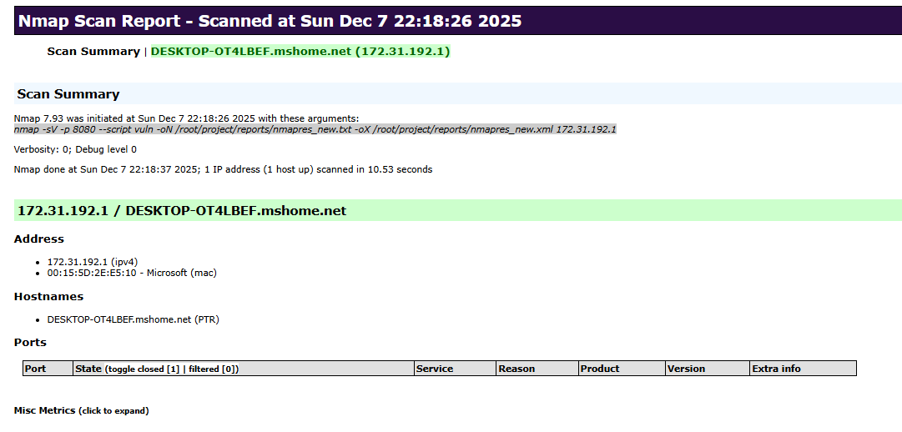

<div align="center">
<h1><a id="intro">Лабораторная работа №3</a><br></h1>
<a href="https://docs.github.com/en"></a>
<a href="https://daringfireball.net/projects/markdown"></a> 
<a href="https://symbl.cc/en/unicode-table"></a> 
<a href="https://shields.io"></a>
<a href="https://img.shields.io/badge/Risk_Analyze-2448a2"></a> </a> </a></div>


## Задание

- [X] 1. Опишите используемые методы по их назначению, как они функционируют и какие результаты могут дать для оценки. Используйте сноску из материалов выше по флагам команд.

### 1.1 TCP connect scan -sT

__Назначение__: базовый способ проверки порта.

__Как работает__: Nmap выполняет полный TCP-handshake (SYN → SYN/ACK → ACK).

__Особенности__:

- 100% достоверное определение открытых TCP-портов

- доволно заметный метод

Используется, когда нет raw-socket привилегий (обычный пользователь).

### 1.2 TCP SYN scan -sS (stealth-scan)

__Назначение__: скрытный скан.

__Как работает__: Отправляется SYN, если приходит SYN/ACK, значит порт открыт. Сразу посылается RST, чтобы не завершать handshake.

__Особенности__:

- скрытное определение портов

- быстрее, чем connect-scan

- наиболее используемый метод пентестерами

### 1.3 NULL-scan -sN

__Назначение__: обход фильтров и слабых стеков TCP.

__Как работает__: отправляется пакет без флагов.

__Особенности__

- если порт закрыт → RST

- если открыт → никакого ответа

Используется для выявления нестандартных стеков, плохо настроенных firewalls.

### 1.4 FIN-scan -sF

__Назначение__: обнаружение портов на системах со слабой реализацией RFC 793.

__Как работает__: пакет с флагом FIN.

__Особенности__:

- закрытый порт → RST

- открытый → нет ответа

Похож на NULL-scan.

### 1.5 Xmas-scan -sX

__Назначение__: еще один вариант "особых флагов".

__Как работает__: отправляется пакет с FIN + PSH + URG

__Особенности__:

- закрытый → RST

- открытый → тишина

Используется для обхода старых IDS.

### 1.6 TCP Idle scan -sI

__Назначение__: полностью невидимое сканирование.

__Как работает__: Используется "зомби-хост". Атакуемый сервер думает, что сканирует зомби

__Особенности__:

- 100% анонимность

- скрытное исследование активности

Применяется редко из-за требований к “зомби”.

### 1.7 UDP scan -sU

__Назначение__: выявление UDP-служб.

__Как работает__: отправляет пустой UDP-пакет.

__Особенности__:

- если порт закрыт → ICMP Port Unreachable

- если порт открыт → есть ответ или тишина

-  медленное и неточное сканирование

### 1.8 OS detection -A

__Назначение__: определение ОС и сервисов.

__Как работает__: анализ TCP/IP fingerprint.

__Что даёт__:

- название ОС

- версия ядра

- список сервисов с версиями

Полезно для уязвимостей типа: Samba CVE, Apache outdated, OpenSSH outdated

- [X] 2. Выведите на терминале и проанализируйте следующие команды консоли

```bash
$ nmap localhost
$ nmap -sC localhost

$ nmap -p localhost
$ nmap -O localhost

$ nmap -p 80 localhost
$ nmap -p 443 localhost
$ nmap -p 8443 localhost
$ nmap -p "*" localhost
$ nmap -sV -p 22,8080 localhost

$ nmap -sP 192.168.1.0/24
$ nmap --open 192.168.1.1
$ nmap --packet-trace 192.168.1.1
$ nmap --packet-trace scanme.nmap.org 
$ nmap --iflist

$ nmap -iL scanme.nmap.org 
$ nmap -A -iL scanme.nmap.org 
$ nmap -sA scanme.nmap.org
$ nmap -PN scanme.nmap.org 

$ nmap --script=vuln IP_addr -vv
$ nmap -sV --script vuln -oN nmapres_new.txt localhost
$ cat > ./nmapres_new.txt # сделать подобный пример файлу exmp_targets.txt
$ grep "VULNERABLE" nmapres_new.txt

$ mkdir -p ~/project/reports
$ nmap -sV -p 8080 --script vuln -oN ~/project/reports/nmapres_new.txt -oX ~/project/reports/nmapres_new.xml localhost
$ xsltproc ~/project/reports/nmapres_new.xml -o ~/project/reports/nmapres_new.html
```

### 2.1 Базовое сканирование 1000 самых популярных TCP-портов
```bash
root@DESKTOP-OT4LBEF:/home/uniqm# nmap localhost
Starting Nmap 7.93 ( https://nmap.org ) at 2025-12-07 21:01 MSK
Nmap scan report for localhost (127.0.0.1)
Host is up (0.000011s latency).
Not shown: 999 closed tcp ports (reset)
PORT     STATE    SERVICE
5000/tcp filtered upnp

Nmap done: 1 IP address (1 host up) scanned in 1.29 seconds
```
999 популярных портов закрыты, система отвечает RST.

5000/tcp filtered upnp → Nmap не может сказать, открыт порт или закрыт: пакеты не доходят, теряются или блокируются.

### 2.2 Запускаем стандартный набор NSE-скриптов
```bash
root@DESKTOP-OT4LBEF:/home/uniqm# nmap -sC localhost
Starting Nmap 7.93 ( https://nmap.org ) at 2025-12-07 21:01 MSK
Nmap scan report for localhost (127.0.0.1)
Host is up (0.000011s latency).
Not shown: 999 closed tcp ports (reset)
PORT     STATE    SERVICE
5000/tcp filtered upnp

Nmap done: 1 IP address (1 host up) scanned in 1.61 seconds
```
Так как порт 5000/tcp filtered, скриптам просто не на чем работать: скрипты требуют ответа от приложения

__Некорректная команда.__ Опция `-p` ожидает номера портов или сервисы, кторые необходимо просканировать 
```bash
root@DESKTOP-OT4LBEF:/home/uniqm# nmap -p localhost
Starting Nmap 7.93 ( https://nmap.org ) at 2025-12-07 21:01 MSK
Found no matches for the service mask 'localhost' and your specified protocols
QUITTING!
```

### 2.3 OS fingerprinting
```bash
root@DESKTOP-OT4LBEF:/home/uniqm# nmap -O localhost
Starting Nmap 7.93 ( https://nmap.org ) at 2025-12-07 21:02 MSK
Nmap scan report for localhost (127.0.0.1)
Host is up (0.000069s latency).
Not shown: 999 closed tcp ports (reset)
PORT     STATE    SERVICE
5000/tcp filtered upnp
Too many fingerprints match this host to give specific OS details
Network Distance: 0 hops

OS detection performed. Please report any incorrect results at https://nmap.org/submit/ .
Nmap done: 1 IP address (1 host up) scanned in 2.87 seconds
```
Из портов всё тот же единсвенный 5000/tcp filtered.

По тем данным, которые Nmap смог собрать, хост похож сразу на много разных систем, поэтому он не может с уверенностью определить систему.

Если просканировать хостовую Windows систему, то будет такой результат:
```bash
root@DESKTOP-OT4LBEF:/home/uniqm# nmap -O 172.31.192.1
Starting Nmap 7.93 ( https://nmap.org ) at 2025-12-07 21:12 MSK
Nmap scan report for DESKTOP-OT4LBEF.mshome.net (172.31.192.1)
Host is up (0.00058s latency).
Not shown: 993 closed tcp ports (reset)
PORT     STATE SERVICE
135/tcp  open  msrpc
139/tcp  open  netbios-ssn
445/tcp  open  microsoft-ds
902/tcp  open  iss-realsecure
912/tcp  open  apex-mesh
3389/tcp open  ms-wbt-server
5357/tcp open  wsdapi
MAC Address: 00:15:5D:2E:E5:10 (Microsoft)
No exact OS matches for host (If you know what OS is running on it, see https://nmap.org/submit/ ).
TCP/IP fingerprint:
OS:SCAN(V=7.93%E=4%D=12/7%OT=135%CT=1%CU=39446%PV=Y%DS=1%DC=D%G=Y%M=00155D%
OS:TM=6935C383%P=x86_64-pc-linux-gnu)SEQ(SP=106%GCD=1%ISR=10D%TI=I%CI=I%II=
OS:I%SS=S%TS=A)OPS(O1=M5B4NW8ST11%O2=M5B4NW8ST11%O3=M5B4NW8NNT11%O4=M5B4NW8
OS:ST11%O5=M5B4NW8ST11%O6=M5B4ST11)WIN(W1=FFFF%W2=FFFF%W3=FFFF%W4=FFFF%W5=F
OS:FFF%W6=FFFF)ECN(R=Y%DF=Y%T=80%W=FFFF%O=M5B4NW8NNS%CC=N%Q=)T1(R=Y%DF=Y%T=
OS:80%S=O%A=S+%F=AS%RD=0%Q=)T2(R=Y%DF=Y%T=80%W=0%S=Z%A=S%F=AR%O=%RD=0%Q=)T3
OS:(R=N)T4(R=Y%DF=Y%T=80%W=0%S=A%A=O%F=R%O=%RD=0%Q=)T5(R=Y%DF=Y%T=80%W=0%S=
OS:Z%A=S+%F=AR%O=%RD=0%Q=)T6(R=Y%DF=Y%T=80%W=0%S=A%A=O%F=R%O=%RD=0%Q=)T7(R=
OS:Y%DF=Y%T=80%W=0%S=Z%A=S+%F=AR%O=%RD=0%Q=)U1(R=Y%DF=N%T=80%IPL=164%UN=0%R
OS:IPL=G%RID=G%RIPCK=G%RUCK=G%RUD=G)IE(R=Y%DFI=N%T=80%CD=Z)

Network Distance: 1 hop

OS detection performed. Please report any incorrect results at https://nmap.org/submit/ .
Nmap done: 1 IP address (1 host up) scanned in 12.67 seconds
```

### 2.4 Cкан 80 порта
```bash
root@DESKTOP-OT4LBEF:/home/uniqm# nmap -p 80 localhost
Starting Nmap 7.93 ( https://nmap.org ) at 2025-12-07 21:02 MSK
Nmap scan report for localhost (127.0.0.1)
Host is up (0.000058s latency).

PORT   STATE  SERVICE
80/tcp closed http

Nmap done: 1 IP address (1 host up) scanned in 0.08 seconds
```
Хост отвечает RST на SYN, а значит порт закрыт

### 2.5 Cкан 443 порта
```bash
root@DESKTOP-OT4LBEF:/home/uniqm# nmap -p 443 localhost
Starting Nmap 7.93 ( https://nmap.org ) at 2025-12-07 21:02 MSK
Nmap scan report for localhost (127.0.0.1)
Host is up (0.000063s latency).

PORT    STATE  SERVICE
443/tcp closed https

Nmap done: 1 IP address (1 host up) scanned in 0.07 seconds
```
Хост отвечает RST на SYN, а значит порт закрыт

### 2.6 Cкан 8443 порта
```bash
root@DESKTOP-OT4LBEF:/home/uniqm# nmap -p 8443 localhost
Starting Nmap 7.93 ( https://nmap.org ) at 2025-12-07 21:02 MSK
Nmap scan report for localhost (127.0.0.1)
Host is up (0.000058s latency).

PORT     STATE  SERVICE
8443/tcp closed https-alt

Nmap done: 1 IP address (1 host up) scanned in 0.07 seconds
```
Хост отвечает RST на SYN, а значит порт закрыт

### 2.7 Cкан всех сервисов
```bash
root@DESKTOP-OT4LBEF:/home/uniqm# nmap -p "*" localhost
Starting Nmap 7.93 ( https://nmap.org ) at 2025-12-07 21:02 MSK
Nmap scan report for localhost (127.0.0.1)
Host is up (0.000011s latency).
Not shown: 8363 closed tcp ports (reset)
PORT      STATE    SERVICE
2377/tcp  open     swarm
5000/tcp  filtered upnp
36105/tcp open     unknown

Nmap done: 1 IP address (1 host up) scanned in 1.41 seconds
```
Nmap сканирует сервисы по маске "*". Среди 8366 известных сервисов обнаружено 3:

- 2377/tcp open swarm → известный порт Docker Swarm (менеджер / cluster control)
- 5000/tcp filtered upnp → как и раньше
- 36105/tcp open unknown → порт открыт, но Nmap не знает, что это за сервис

### 2.8 Version detection
```bash
root@DESKTOP-OT4LBEF:/home/uniqm# nmap -sV -p 22,8080 localhost
Starting Nmap 7.93 ( https://nmap.org ) at 2025-12-07 21:02 MSK
Nmap scan report for localhost (127.0.0.1)
Host is up (0.000081s latency).

PORT     STATE  SERVICE    VERSION
22/tcp   closed ssh
8080/tcp closed http-proxy

Service detection performed. Please report any incorrect results at https://nmap.org/submit/ .
Nmap done: 1 IP address (1 host up) scanned in 0.43 seconds
```
Nmap пытается подключиться к каждому открытому порту, прочитать баннер/ответ и определить конкретный сервис и его версию.

Оба порта closed, поэтому результатов нет

### 2.8 Пинг-скан диапазона адресов
```bash
root@DESKTOP-OT4LBEF:/home/uniqm/DevSecOps/risk_course_labs/labs/lab03# nmap -sP 172.31.203.172/20
Starting Nmap 7.93 ( https://nmap.org ) at 2025-12-07 22:29 MSK
Nmap scan report for DESKTOP-OT4LBEF.mshome.net (172.31.192.1)
Host is up (0.00045s latency).
MAC Address: 00:15:5D:2E:E5:10 (Microsoft)
Nmap scan report for 172.31.203.172
Host is up.
Nmap done: 4096 IP addresses (2 hosts up) scanned in 20.81 seconds
```
Сканируем сеть 172.31.203.172/20. Nmap с опцией -sP осуществляет ping-scan, не привязываясь к портам

Обнаружено 2 живых хоста: DESKTOP-OT4LBEF.mshome.net (172.31.192.1) и 172.31.203.172.

### 2.9 Скан открытых портов шлюза
```bash
root@DESKTOP-OT4LBEF:/home/uniqm/DevSecOps/risk_course_labs/labs/lab03# nmap --open 172.31.192.1
Starting Nmap 7.93 ( https://nmap.org ) at 2025-12-07 22:35 MSK
Nmap scan report for DESKTOP-OT4LBEF.mshome.net (172.31.192.1)
Host is up (0.0012s latency).
Not shown: 993 closed tcp ports (reset)
PORT     STATE SERVICE
135/tcp  open  msrpc
139/tcp  open  netbios-ssn
445/tcp  open  microsoft-ds
902/tcp  open  iss-realsecure
912/tcp  open  apex-mesh
3389/tcp open  ms-wbt-server
5357/tcp open  wsdapi
MAC Address: 00:15:5D:2E:E5:10 (Microsoft)

Nmap done: 1 IP address (1 host up) scanned in 1.29 seconds
```
Опция `--open` показывает только порты в состоянии open.

Результаты:

- 135/tcp msrpc — Microsoft RPC (служба удалённых вызовов).
- 139/tcp netbios-ssn и 445/tcp microsoft-ds — NetBIOS/SMB, файловые и принт-шары, доменная инфраструктура.
- 3389/tcp ms-wbt-server — RDP (удалённый рабочий стол Windows).
- 902/tcp и 912/tcp — сервисы VMware (auth/управление).
- 5357/tcp wsdapi — Web Services for Devices API (службы обнаружения устройств/служб по HTTP).

### 2.10 Детальный разбор
```bash
root@DESKTOP-OT4LBEF:/home/uniqm/DevSecOps/risk_course_labs/labs/lab03# nmap --packet-trace 172.31.192.1
Starting Nmap 7.93 ( https://nmap.org ) at 2025-12-07 22:36 MSK
SENT (0.0572s) ARP who-has 172.31.192.1 tell 172.31.203.172
RCVD (0.0575s) ARP reply 172.31.192.1 is-at 00:15:5D:2E:E5:10
NSOCK INFO [0.1080s] nsock_iod_new2(): nsock_iod_new (IOD #1)
NSOCK INFO [0.1080s] nsock_connect_udp(): UDP connection requested to 10.255.255.254:53 (IOD #1) EID 8
NSOCK INFO [0.1080s] nsock_read(): Read request from IOD #1 [10.255.255.254:53] (timeout: -1ms) EID 18
NSOCK INFO [0.1080s] nsock_write(): Write request for 43 bytes to IOD #1 EID 27 [10.255.255.254:53]
NSOCK INFO [0.1080s] nsock_trace_handler_callback(): Callback: CONNECT SUCCESS for EID 8 [10.255.255.254:53]
NSOCK INFO [0.1080s] nsock_trace_handler_callback(): Callback: WRITE SUCCESS for EID 27 [10.255.255.254:53]
NSOCK INFO [0.1110s] nsock_trace_handler_callback(): Callback: READ SUCCESS for EID 18 [10.255.255.254:53] (108 bytes)
NSOCK INFO [0.1110s] nsock_read(): Read request from IOD #1 [10.255.255.254:53] (timeout: -1ms) EID 34
NSOCK INFO [0.1110s] nsock_iod_delete(): nsock_iod_delete (IOD #1)
NSOCK INFO [0.1110s] nevent_delete(): nevent_delete on event #34 (type READ)
SENT (0.1254s) TCP 172.31.203.172:47694 > 172.31.192.1:80 S ttl=51 id=39906 iplen=44  seq=4099788793 win=1024 <mss 1460>
SENT (0.1255s) TCP 172.31.203.172:47694 > 172.31.192.1:3306 S ttl=56 id=58497 iplen=44  seq=4099788793 win=1024 <mss 1460>
SENT (0.1259s) TCP 172.31.203.172:47694 > 172.31.192.1:256 S ttl=42 id=5587 iplen=44  seq=4099788793 win=1024 <mss 1460>
SENT (0.1260s) TCP 172.31.203.172:47694 > 172.31.192.1:25 S ttl=37 id=9175 iplen=44  seq=4099788793 win=1024 <mss 1460>
SENT (0.1260s) TCP 172.31.203.172:47694 > 172.31.192.1:53 S ttl=55 id=18954 iplen=44  seq=4099788793 win=1024 <mss 1460>
SENT (0.1260s) TCP 172.31.203.172:47694 > 172.31.192.1:113 S ttl=51 id=58646 iplen=44  seq=4099788793 win=1024 <mss 1460>
SENT (0.1261s) TCP 172.31.203.172:47694 > 172.31.192.1:8888 S ttl=57 id=29513 iplen=44  seq=4099788793 win=1024 <mss 1460>
SENT (0.1261s) TCP 172.31.203.172:47694 > 172.31.192.1:23 S ttl=52 id=11350 iplen=44  seq=4099788793 win=1024 <mss 1460>
SENT (0.1264s) TCP 172.31.203.172:47694 > 172.31.192.1:135 S ttl=45 id=14160 iplen=44  seq=4099788793 win=1024 <mss 1460>
SENT (0.1265s) TCP 172.31.203.172:47694 > 172.31.192.1:22 S ttl=41 id=16740 iplen=44  seq=4099788793 win=1024 <mss 1460>
RCVD (0.1258s) TCP 172.31.192.1:3306 > 172.31.203.172:47694 RA ttl=128 id=28960 iplen=40  seq=0 win=0
RCVD (0.1259s) TCP 172.31.192.1:80 > 172.31.203.172:47694 RA ttl=128 id=28959 iplen=40  seq=0 win=0
RCVD (0.1261s) TCP 172.31.192.1:256 > 172.31.203.172:47694 RA ttl=128 id=28961 iplen=40  seq=0 win=0
...
RCVD (0.1846s) TCP 172.31.192.1:4129 > 172.31.203.172:47694 RA ttl=128 id=29952 iplen=40  seq=0 win=0
RCVD (0.1846s) TCP 172.31.192.1:3689 > 172.31.203.172:47694 RA ttl=128 id=29955 iplen=40  seq=0 win=0
RCVD (0.1847s) TCP 172.31.192.1:7435 > 172.31.203.172:47694 RA ttl=128 id=29956 iplen=40  seq=0 win=0
RCVD (0.1847s) TCP 172.31.192.1:8291 > 172.31.203.172:47694 RA ttl=128 id=29957 iplen=40  seq=0 win=0
RCVD (0.1847s) TCP 172.31.192.1:1023 > 172.31.203.172:47694 RA ttl=128 id=29958 iplen=40  seq=0 win=0
Nmap scan report for DESKTOP-OT4LBEF.mshome.net (172.31.192.1)
Host is up (0.00031s latency).
Not shown: 993 closed tcp ports (reset)
PORT     STATE SERVICE
135/tcp  open  msrpc
139/tcp  open  netbios-ssn
445/tcp  open  microsoft-ds
902/tcp  open  iss-realsecure
912/tcp  open  apex-mesh
3389/tcp open  ms-wbt-server
5357/tcp open  wsdapi
MAC Address: 00:15:5D:2E:E5:10 (Microsoft)

Nmap done: 1 IP address (1 host up) scanned in 0.23 seconds
```
1) Nmap сначала использует ARP для локальной сети, определяя MAC
2) Затем обращается к DNS серверу для определения доменных имён
3) После этого проводит TCP-скан популярных портов

### 2.11 Подробный вывод скана scanme.nmap.org
```bash
root@DESKTOP-OT4LBEF:/home/uniqm# nmap --packet-trace scanme.nmap.org
Starting Nmap 7.93 ( https://nmap.org ) at 2025-12-07 21:44 MSK
SENT (0.3024s) ICMP [172.31.203.172 > 45.33.32.156 Echo request (type=8/code=0) id=54253 seq=0] IP [ttl=42 id=49060 iplen=28 ]
SENT (0.3025s) TCP 172.31.203.172:58208 > 45.33.32.156:443 S ttl=43 id=35445 iplen=44  seq=1752438455 win=1024 <mss 1460>
SENT (0.3029s) TCP 172.31.203.172:58208 > 45.33.32.156:80 A ttl=38 id=12119 iplen=40  seq=0 win=1024
SENT (0.3029s) ICMP [172.31.203.172 > 45.33.32.156 Timestamp request (type=13/code=0) id=39767 seq=0 orig=0 recv=0 trans=0] IP [ttl=48 id=29886 iplen=40 ]
RCVD (0.4884s) ICMP [45.33.32.156 > 172.31.203.172 Echo reply (type=0/code=0) id=54253 seq=0] IP [ttl=41 id=28243 iplen=28 ]
NSOCK INFO [0.5180s] nsock_iod_new2(): nsock_iod_new (IOD #1)
NSOCK INFO [0.5180s] nsock_connect_udp(): UDP connection requested to 10.255.255.254:53 (IOD #1) EID 8
NSOCK INFO [0.5180s] nsock_read(): Read request from IOD #1 [10.255.255.254:53] (timeout: -1ms) EID 18
NSOCK INFO [0.5190s] nsock_write(): Write request for 43 bytes to IOD #1 EID 27 [10.255.255.254:53]
NSOCK INFO [0.5190s] nsock_trace_handler_callback(): Callback: CONNECT SUCCESS for EID 8 [10.255.255.254:53]
NSOCK INFO [0.5190s] nsock_trace_handler_callback(): Callback: WRITE SUCCESS for EID 27 [10.255.255.254:53]
NSOCK INFO [0.7850s] nsock_trace_handler_callback(): Callback: READ SUCCESS for EID 18 [10.255.255.254:53] (72 bytes): R............156.32.33.45.in-addr.arpa..............+...scanme.nmap.org.
NSOCK INFO [0.7850s] nsock_read(): Read request from IOD #1 [10.255.255.254:53] (timeout: -1ms) EID 34
NSOCK INFO [0.7850s] nsock_iod_delete(): nsock_iod_delete (IOD #1)
NSOCK INFO [0.7850s] nevent_delete(): nevent_delete on event #34 (type READ)
SENT (0.7982s) TCP 172.31.203.172:58464 > 45.33.32.156:993 S ttl=46 id=23728 iplen=44  seq=1819181841 win=1024 <mss 1460>
SENT (0.7983s) TCP 172.31.203.172:58464 > 45.33.32.156:23 S ttl=54 id=26595 iplen=44  seq=1819181841 win=1024 <mss 1460>
SENT (0.7983s) TCP 172.31.203.172:58464 > 45.33.32.156:8080 S ttl=45 id=10139 iplen=44  seq=1819181841 win=1024 <mss 1460>
SENT (0.7983s) TCP 172.31.203.172:58464 > 45.33.32.156:3389 S ttl=39 id=64939 iplen=44  seq=1819181841 win=1024 <mss 1460>
SENT (0.7984s) TCP 172.31.203.172:58464 > 45.33.32.156:111 S ttl=42 id=33736 iplen=44  seq=1819181841 win=1024 <mss 1460>
...
SENT (18.2321s) TCP 172.31.203.172:58466 > 45.33.32.156:3168 S ttl=54 id=20460 iplen=44  seq=1819050771 win=1024 <mss 1460>
SENT (18.2374s) TCP 172.31.203.172:58466 > 45.33.32.156:417 S ttl=51 id=49250 iplen=44  seq=1819050771 win=1024 <mss 1460>
RCVD (18.2456s) TCP 45.33.32.156:3168 > 172.31.203.172:58464 RA ttl=37 id=0 iplen=40  seq=0 win=0
RCVD (18.2456s) TCP 45.33.32.156:64623 > 172.31.203.172:58464 RA ttl=37 id=0 iplen=40  seq=0 win=0
RCVD (18.2503s) TCP 45.33.32.156:417 > 172.31.203.172:58464 RA ttl=37 id=0 iplen=40  seq=0 win=0
RCVD (18.4165s) TCP 45.33.32.156:3168 > 172.31.203.172:58466 RA ttl=41 id=0 iplen=40  seq=0 win=0
RCVD (18.4165s) TCP 45.33.32.156:64623 > 172.31.203.172:58466 RA ttl=41 id=0 iplen=40  seq=0 win=0
RCVD (18.4312s) TCP 45.33.32.156:417 > 172.31.203.172:58466 RA ttl=37 id=0 iplen=40  seq=0 win=0
Nmap scan report for scanme.nmap.org (45.33.32.156)
Host is up (0.20s latency).
Other addresses for scanme.nmap.org (not scanned): 2600:3c01::f03c:91ff:fe18:bb2f
Not shown: 990 closed tcp ports (reset)
PORT      STATE    SERVICE
22/tcp    open     ssh
25/tcp    filtered smtp
80/tcp    open     http
135/tcp   filtered msrpc
139/tcp   filtered netbios-ssn
445/tcp   filtered microsoft-ds
593/tcp   filtered http-rpc-epmap
1434/tcp  filtered ms-sql-m
9929/tcp  open     nping-echo
31337/tcp open     Elite

Nmap done: 1 IP address (1 host up) scanned in 18.47 seconds
```
Аналогично скану локальной сети, но вместо ARP-запросов используются ICMP

### 2.12 Топология моей сети
```bash
root@DESKTOP-OT4LBEF:/home/uniqm# nmap --iflist
Starting Nmap 7.93 ( https://nmap.org ) at 2025-12-07 21:46 MSK
************************INTERFACES************************
DEV             (SHORT)           IP/MASK                      TYPE     UP MTU   MAC
lo              (lo)              127.0.0.1/8                  loopback up 65536
lo              (lo)              10.255.255.254/8             loopback up 65536
lo              (lo)              ::1/128                      loopback up 65536
eth0            (eth0)            172.31.203.172/20            ethernet up 1500  00:15:5D:C4:2B:9F
eth0            (eth0)            fe80::215:5dff:fec4:2b9f/64  ethernet up 1500  00:15:5D:C4:2B:9F
br-808a5f6bdc22 (br-808a5f6bdc22) 172.18.0.1/16                ethernet up 1500  02:42:F5:A2:ED:75
docker0         (docker0)         172.17.0.1/16                ethernet up 1500  02:42:F6:DD:3C:83
docker_gwbridge (docker_gwbridge) 172.20.0.1/16                ethernet up 1500  02:42:58:7A:E0:B4
docker_gwbridge (docker_gwbridge) fe80::42:58ff:fe7a:e0b4/64   ethernet up 1500  02:42:58:7A:E0:B4
vethd451649     (vethd451649)     (none)/0                     ethernet up 1500  2E:CB:55:18:92:45
vethd451649     (vethd451649)     fe80::2ccb:55ff:fe18:9245/64 ethernet up 1500  2E:CB:55:18:92:45
veth9708637     (veth9708637)     (none)/0                     ethernet up 1500  7A:05:DF:E5:4F:5E
veth9708637     (veth9708637)     fe80::7805:dfff:fee5:4f5e/64 ethernet up 1500  7A:05:DF:E5:4F:5E

**************************ROUTES**************************
DST/MASK                      DEV             METRIC GATEWAY
172.31.192.0/20               eth0            0
172.17.0.0/16                 docker0         0
172.18.0.0/16                 br-808a5f6bdc22 0
172.20.0.0/16                 docker_gwbridge 0
0.0.0.0/0                     eth0            0      172.31.192.1
::1/128                       lo              0
fe80::42:58ff:fe7a:e0b4/128   docker_gwbridge 0
fe80::215:5dff:fec4:2b9f/128  eth0            0
fe80::2ccb:55ff:fe18:9245/128 vethd451649     0
fe80::7805:dfff:fee5:4f5e/128 veth9708637     0
fe80::/64                     eth0            256
fe80::/64                     vethd451649     256
fe80::/64                     docker_gwbridge 256
fe80::/64                     veth9708637     256
ff00::/8                      eth0            256
ff00::/8                      vethd451649     256
ff00::/8                      docker_gwbridge 256
ff00::/8                      veth9708637     256
```
Показывает интерфейсы на машине и настроенные маршруты

Результаты:

- Хост — Linux/WSL внутри среды с IP 172.31.203.172/20.
- 172.31.192.1 — шлюз (это твой Windows-хост, см. дальше).
- Присутствует несколько docker-сетей: 172.17/16, 172.18/16, 172.20/16.

### 2.13 Скан целей из файла
```bash
root@DESKTOP-OT4LBEF:/home/uniqm# echo "scanme.nmap.org" targets.txt
scanme.nmap.org targets.txt
root@DESKTOP-OT4LBEF:/home/uniqm# echo "scanme.nmap.org" > targets.txt
root@DESKTOP-OT4LBEF:/home/uniqm# nmap -iL targets.txt
Starting Nmap 7.93 ( https://nmap.org ) at 2025-12-07 22:00 MSK
Nmap scan report for scanme.nmap.org (45.33.32.156)
Host is up (0.27s latency).
Other addresses for scanme.nmap.org (not scanned): 2600:3c01::f03c:91ff:fe18:bb2f
Not shown: 990 closed tcp ports (reset)
PORT      STATE    SERVICE
22/tcp    open     ssh
25/tcp    filtered smtp
80/tcp    open     http
135/tcp   filtered msrpc
139/tcp   filtered netbios-ssn
445/tcp   filtered microsoft-ds
593/tcp   filtered http-rpc-epmap
1434/tcp  filtered ms-sql-m
9929/tcp  open     nping-echo
31337/tcp open     Elite

Nmap done: 1 IP address (1 host up) scanned in 14.68 seconds
```

### 2.14 Расширенный скан целей из файла
```bash
root@DESKTOP-OT4LBEF:/home/uniqm# nmap -A -iL targets.txt
Starting Nmap 7.93 ( https://nmap.org ) at 2025-12-07 22:00 MSK
Nmap scan report for scanme.nmap.org (45.33.32.156)
Host is up (0.20s latency).
Other addresses for scanme.nmap.org (not scanned): 2600:3c01::f03c:91ff:fe18:bb2f
Not shown: 990 closed tcp ports (reset)
PORT      STATE    SERVICE        VERSION
22/tcp    open     ssh            OpenSSH 6.6.1p1 Ubuntu 2ubuntu2.13 (Ubuntu Linux; protocol 2.0)
| ssh-hostkey:
|   1024 ac00a01a82ffcc5599dc672b34976b75 (DSA)
|   2048 203d2d44622ab05a9db5b30514c2a6b2 (RSA)
|   256 9602bb5e57541c4e452f564c4a24b257 (ECDSA)
|_  256 33fa910fe0e17b1f6d05a2b0f1544156 (ED25519)
25/tcp    filtered smtp
80/tcp    open     http           Apache httpd 2.4.7 ((Ubuntu))
|_http-server-header: Apache/2.4.7 (Ubuntu)
|_http-favicon: Nmap Project
|_http-title: Go ahead and ScanMe!
135/tcp   filtered msrpc
139/tcp   filtered netbios-ssn
445/tcp   filtered microsoft-ds
593/tcp   filtered http-rpc-epmap
1434/tcp  filtered ms-sql-m
9929/tcp  open     nping-echo     Nping echo
31337/tcp open     tcpwrapped
Aggressive OS guesses: Linux 3.4 (93%), Linux 2.6.32 (88%), Linux 2.6.32 or 3.10 (88%), Linux 2.6.39 (88%), Linux 3.10 - 3.12 (88%), Linux 4.4 (88%), WatchGuard Fireware 11.8 (88%), Synology DiskStation Manager 5.1 (87%), Linux 2.6.35 (87%), Linux 4.9 (87%)
No exact OS matches for host (test conditions non-ideal).
Network Distance: 24 hops
Service Info: OS: Linux; CPE: cpe:/o:linux:linux_kernel

TRACEROUTE (using port 21/tcp)
HOP RTT       ADDRESS
1   0.35 ms   DESKTOP-OT4LBEF.mshome.net (172.31.192.1)
2   2.54 ms   10.51.16.17
3   ... 23
24  255.65 ms scanme.nmap.org (45.33.32.156)

OS and Service detection performed. Please report any incorrect results at https://nmap.org/submit/ .
Nmap done: 1 IP address (1 host up) scanned in 49.03 seconds
```
`-A` добавляет OS fingerprinting, version detection (-sV), traceroute

### 2.15 ACK scan
```bash
root@DESKTOP-OT4LBEF:/home/uniqm# nmap -sA scanme.nmap.org
Starting Nmap 7.93 ( https://nmap.org ) at 2025-12-07 22:01 MSK
Nmap scan report for scanme.nmap.org (45.33.32.156)
Host is up (0.19s latency).
Other addresses for scanme.nmap.org (not scanned): 2600:3c01::f03c:91ff:fe18:bb2f
All 1000 scanned ports on scanme.nmap.org (45.33.32.156) are in ignored states.
Not shown: 1000 filtered tcp ports (no-response)

Nmap done: 1 IP address (1 host up) scanned in 196.16 seconds
```
Шлёт TCP ACK с целью определить фильтрацию firewall (если порт unfiltered → приходит RST, если filtered → нет ответа).

### 2.16 Отключение Ping-проверки
```bash
root@DESKTOP-OT4LBEF:/home/uniqm# nmap -PN scanme.nmap.org
Starting Nmap 7.93 ( https://nmap.org ) at 2025-12-07 22:06 MSK
Nmap scan report for scanme.nmap.org (45.33.32.156)
Host is up (0.20s latency).
Other addresses for scanme.nmap.org (not scanned): 2600:3c01::f03c:91ff:fe18:bb2f
Not shown: 990 closed tcp ports (reset)
PORT      STATE    SERVICE
22/tcp    open     ssh
25/tcp    filtered smtp
80/tcp    open     http
135/tcp   filtered msrpc
139/tcp   filtered netbios-ssn
445/tcp   filtered microsoft-ds
593/tcp   filtered http-rpc-epmap
1434/tcp  filtered ms-sql-m
9929/tcp  open     nping-echo
31337/tcp open     Elite

Nmap done: 1 IP address (1 host up) scanned in 17.83 seconds
```
Опция `-PN` позволяет считать хост живым и сразу сканировать порты без ping-проверки.

Может быть полезно, когда хост блокирует ICMP-пакеты, из-за чего стандартное сканирование считает его ‘down’, хотя TCP-сервисы доступны

### 2.17 Проверка уязвимостей шлюза
```bash
root@DESKTOP-OT4LBEF:/home/uniqm# nmap --script=vuln 172.31.192.1 -vv
Starting Nmap 7.93 ( https://nmap.org ) at 2025-12-07 22:08 MSK
NSE: Loaded 105 scripts for scanning.
NSE: Script Pre-scanning.
NSE: Starting runlevel 1 (of 2) scan.
Initiating NSE at 22:08
Completed NSE at 22:08, 10.00s elapsed
NSE: Starting runlevel 2 (of 2) scan.
Initiating NSE at 22:08
Completed NSE at 22:08, 0.00s elapsed
Initiating ARP Ping Scan at 22:08
Scanning 172.31.192.1 [1 port]
Completed ARP Ping Scan at 22:08, 0.03s elapsed (1 total hosts)
Initiating Parallel DNS resolution of 1 host. at 22:08
Completed Parallel DNS resolution of 1 host. at 22:08, 0.00s elapsed
Initiating SYN Stealth Scan at 22:08
Scanning DESKTOP-OT4LBEF.mshome.net (172.31.192.1) [1000 ports]
Discovered open port 445/tcp on 172.31.192.1
Discovered open port 3389/tcp on 172.31.192.1
Discovered open port 135/tcp on 172.31.192.1
Discovered open port 139/tcp on 172.31.192.1
Discovered open port 912/tcp on 172.31.192.1
Discovered open port 5357/tcp on 172.31.192.1
Discovered open port 902/tcp on 172.31.192.1
Completed SYN Stealth Scan at 22:08, 1.15s elapsed (1000 total ports)
NSE: Script scanning 172.31.192.1.
NSE: Starting runlevel 1 (of 2) scan.
Initiating NSE at 22:08
Completed NSE at 22:08, 29.07s elapsed
NSE: Starting runlevel 2 (of 2) scan.
Initiating NSE at 22:08
Completed NSE at 22:08, 0.00s elapsed
Nmap scan report for DESKTOP-OT4LBEF.mshome.net (172.31.192.1)
Host is up, received arp-response (0.00054s latency).
Scanned at 2025-12-07 22:08:12 MSK for 30s
Not shown: 993 closed tcp ports (reset)
PORT     STATE SERVICE        REASON
135/tcp  open  msrpc          syn-ack ttl 128
139/tcp  open  netbios-ssn    syn-ack ttl 128
445/tcp  open  microsoft-ds   syn-ack ttl 128
902/tcp  open  iss-realsecure syn-ack ttl 128
912/tcp  open  apex-mesh      syn-ack ttl 128
3389/tcp open  ms-wbt-server  syn-ack ttl 128
5357/tcp open  wsdapi         syn-ack ttl 128
MAC Address: 00:15:5D:2E:E5:10 (Microsoft)

Host script results:
|_smb-vuln-ms10-054: false
|_samba-vuln-cve-2012-1182: Could not negotiate a connection:SMB: Failed to receive bytes: ERROR
|_smb-vuln-ms10-061: Could not negotiate a connection:SMB: Failed to receive bytes: ERROR

NSE: Script Post-scanning.
NSE: Starting runlevel 1 (of 2) scan.
Initiating NSE at 22:08
Completed NSE at 22:08, 0.00s elapsed
NSE: Starting runlevel 2 (of 2) scan.
Initiating NSE at 22:08
Completed NSE at 22:08, 0.00s elapsed
Read data files from: /usr/bin/../share/nmap
Nmap done: 1 IP address (1 host up) scanned in 40.63 seconds
           Raw packets sent: 1010 (44.424KB) | Rcvd: 1001 (40.056KB)
```
Флаг --script=vuln в Nmap запускает набор NSE-скриптов (Nmap Scripting Engine), относящихся к категории vuln — то есть скрипты, которые проверяют хост на наличие конкретных известных уязвимостей.

Скрипт по открытым портам определил потенциальные уязвимсоти и проверил их реальное наличие на машине

### 2.18 Расширенная проверка уязвимостей шлюза
```bash
root@DESKTOP-OT4LBEF:/home/uniqm/DevSecOps/risk_course_labs/labs/lab03# nmap -sV --script vuln -oN nmapres_new.txt 172.31.192.1
Starting Nmap 7.93 ( https://nmap.org ) at 2025-12-07 22:10 MSK
Nmap scan report for DESKTOP-OT4LBEF.mshome.net (172.31.192.1)
Host is up (0.0010s latency).
Not shown: 993 closed tcp ports (reset)
PORT     STATE SERVICE            VERSION
135/tcp  open  msrpc              Microsoft Windows RPC
139/tcp  open  netbios-ssn        Microsoft Windows netbios-ssn
445/tcp  open  microsoft-ds?
902/tcp  open  ssl/vmware-auth    VMware Authentication Daemon 1.10 (Uses VNC, SOAP)
|_ssl-ccs-injection: No reply from server (TIMEOUT)
912/tcp  open  vmware-auth        VMware Authentication Daemon 1.0 (Uses VNC, SOAP)
3389/tcp open  ssl/ms-wbt-server?
5357/tcp open  http               Microsoft HTTPAPI httpd 2.0 (SSDP/UPnP)
|_http-server-header: Microsoft-HTTPAPI/2.0
|_http-csrf: Couldn't find any CSRF vulnerabilities.
|_http-dombased-xss: Couldn't find any DOM based XSS.
|_http-stored-xss: Couldn't find any stored XSS vulnerabilities.
MAC Address: 00:15:5D:2E:E5:10 (Microsoft)
Service Info: OS: Windows; CPE: cpe:/o:microsoft:windows

Host script results:
|_smb-vuln-ms10-054: false
|_samba-vuln-cve-2012-1182: Could not negotiate a connection:SMB: Failed to receive bytes: ERROR
|_smb-vuln-ms10-061: Could not negotiate a connection:SMB: Failed to receive bytes: ERROR

Service detection performed. Please report any incorrect results at https://nmap.org/submit/ .
Nmap done: 1 IP address (1 host up) scanned in 219.03 seconds
root@DESKTOP-OT4LBEF:/home/uniqm/DevSecOps/risk_course_labs/labs/lab03# grep "VULNERABLE" nmapres_new.txt
```
Флаг `-sV` раскрыл версии и типы сервисов. Скрипты vuln отработали, но уязвимостей не обнаружили.

### 2.19 Экспорт в отчётные форматы
```bash
root@DESKTOP-OT4LBEF:/home/uniqm/DevSecOps/risk_course_labs/labs/lab03# mkdir -p ~/project/reports
root@DESKTOP-OT4LBEF:/home/uniqm/DevSecOps/risk_course_labs/labs/lab03# nmap -sV -p 8080 --script vuln -oN ~/project/reports/nmapres_new.txt -oX ~/project/reports/nmapres_new.xml 172.31.192.1
Starting Nmap 7.93 ( https://nmap.org ) at 2025-12-07 22:18 MSK
Nmap scan report for DESKTOP-OT4LBEF.mshome.net (172.31.192.1)
Host is up (0.00025s latency).

PORT     STATE  SERVICE    VERSION
8080/tcp closed http-proxy
MAC Address: 00:15:5D:2E:E5:10 (Microsoft)

Service detection performed. Please report any incorrect results at https://nmap.org/submit/ .
Nmap done: 1 IP address (1 host up) scanned in 10.53 seconds
root@DESKTOP-OT4LBEF:/home/uniqm/DevSecOps/risk_course_labs/labs/lab03# xsltproc ~/project/reports/nmapres_new.xml -o ~/project/reports/nmapres_new.html
```
Здесь был сформирован html отчёт результатов скана шлюза.




- [X] 3. Используйте команду `tree` и выведите все вложенные файлы по директориям.

```bash
root@DESKTOP-OT4LBEF:/home/uniqm/DevSecOps/risk_course_labs/labs/lab03# tree
.
├── exmp_targets.txt
├── imgs
│   └── image.png
├── nmapres_new.txt
├── README.md
└── report.md

2 directories, 5 files
```

- [X] 4.Найдите IP сетевой карты `Ethernet`, которая соответствует вашей виртуальной машине используя `ifconfig` и выполните команду `nmap -sP inet_addr`

```bash
root@DESKTOP-OT4LBEF:/home/uniqm/DevSecOps/risk_course_labs/labs/lab03# ip a
1: lo: <LOOPBACK,UP,LOWER_UP> mtu 65536 qdisc noqueue state UNKNOWN group default qlen 1000
    link/loopback 00:00:00:00:00:00 brd 00:00:00:00:00:00
    inet 127.0.0.1/8 scope host lo
       valid_lft forever preferred_lft forever
    inet 10.255.255.254/32 brd 10.255.255.254 scope global lo
       valid_lft forever preferred_lft forever
    inet6 ::1/128 scope host
       valid_lft forever preferred_lft forever
2: eth0: <BROADCAST,MULTICAST,UP,LOWER_UP> mtu 1480 qdisc mq state UP group default qlen 1000
    link/ether 00:15:5d:c4:2b:9f brd ff:ff:ff:ff:ff:ff
    inet 172.31.203.172/20 brd 172.31.207.255 scope global eth0
       valid_lft forever preferred_lft forever
    inet6 fe80::215:5dff:fec4:2b9f/64 scope link
       valid_lft forever preferred_lft forever
```

```bash
root@DESKTOP-OT4LBEF:/home/uniqm/DevSecOps/risk_course_labs/labs/lab03# nmap -sP 172.31.203.172
Starting Nmap 7.93 ( https://nmap.org ) at 2025-12-07 23:10 MSK
Nmap scan report for 172.31.203.172
Host is up.
Nmap done: 1 IP address (1 host up) scanned in 11.15 seconds
```

- [X] 5. Определите ОС, данные ssh, telnet  с помощью `nmap` и выведите о них информацию.

```bash
root@DESKTOP-OT4LBEF:/home/uniqm/DevSecOps/risk_course_labs/labs/lab03# nmap -A -p 22,23 172.31.203.172
Starting Nmap 7.93 ( https://nmap.org ) at 2025-12-07 23:12 MSK
Nmap scan report for 172.31.203.172
Host is up (0.00012s latency).

PORT   STATE  SERVICE VERSION
22/tcp closed ssh
23/tcp closed telnet
Too many fingerprints match this host to give specific OS details
Network Distance: 0 hops

OS and Service detection performed. Please report any incorrect results at https://nmap.org/submit/ .
Nmap done: 1 IP address (1 host up) scanned in 13.29 seconds
```
В данном случае порты закрыты, а определить ОС не получилось. Так как нет открытых портов, кроме 5000, Nmap не может получить никаких данных об ОС.

В качестве примера можно определить ОС windows хоста, а не WSL машины:
```bash
root@DESKTOP-OT4LBEF:/home/uniqm/DevSecOps/risk_course_labs/labs/lab03# nmap -A -p 22,23 172.31.192.1
Starting Nmap 7.93 ( https://nmap.org ) at 2025-12-07 23:16 MSK
Nmap scan report for DESKTOP-OT4LBEF.mshome.net (172.31.192.1)
Host is up (0.00041s latency).

PORT   STATE  SERVICE VERSION
22/tcp closed ssh
23/tcp closed telnet
MAC Address: 00:15:5D:2E:E5:10 (Microsoft)
Too many fingerprints match this host to give specific OS details
Network Distance: 1 hop

TRACEROUTE
HOP RTT     ADDRESS
1   0.41 ms DESKTOP-OT4LBEF.mshome.net (172.31.192.1)

OS and Service detection performed. Please report any incorrect results at https://nmap.org/submit/ .
Nmap done: 1 IP address (1 host up) scanned in 7.11 seconds
```

- [X] 6. Результаты из `nmapres_new.txt` надо перенести в `nmapres.txt` и оставить оба файла рядом в локальном репозитории. Желательно использовать `cp` в консоли через редактор.

```bash
root@DESKTOP-OT4LBEF:/home/uniqm/DevSecOps/risk_course_labs/labs/lab03# ls -l
total 64
-rw-r--r-- 1 uniqm uniqm    68 Nov 30 16:04 exmp_targets.txt
drwxr-xr-x 2 uniqm uniqm  4096 Dec  7 23:08 imgs
-rw-r--r-- 1 root  root   1507 Dec  7 22:14 nmapres_new.txt
-rw-r--r-- 1 uniqm uniqm 10714 Nov 30 16:04 README.md
-rw-r--r-- 1 uniqm uniqm 40812 Dec  7 23:13 report.md
root@DESKTOP-OT4LBEF:/home/uniqm/DevSecOps/risk_course_labs/labs/lab03# cp nmapres_new.txt nmapres.txt
root@DESKTOP-OT4LBEF:/home/uniqm/DevSecOps/risk_course_labs/labs/lab03# ls -l
total 68
-rw-r--r-- 1 uniqm uniqm    68 Nov 30 16:04 exmp_targets.txt
drwxr-xr-x 2 uniqm uniqm  4096 Dec  7 23:08 imgs
-rw-r--r-- 1 root  root   1507 Dec  7 22:14 nmapres_new.txt
-rw-r--r-- 1 root  root   1507 Dec  7 23:14 nmapres.txt
-rw-r--r-- 1 uniqm uniqm 10714 Nov 30 16:04 README.md
-rw-r--r-- 1 uniqm uniqm 40812 Dec  7 23:13 report.md
```

- [X] 7. Оформить `README.md` по аналогии и использовать `shield`, etc.
- [X] 8. Составить `gist` отчет и отправить ссылку личным сообщением

***

## Links

- [Markdown](https://stackedit.io)
- [Gist](https://gist.github.com)
- [nmap.org](https://nmap.org/book/port-scanning-options.html)
- [nmap github](https://github.com/nmap/nmap?ysclid=mi7x8wdde7291330856)
- [IANA](https://www.iana.org)
- [GitHub CLI](https://cli.github.com)

Copyright (c) 2025 Nikita Sergeev